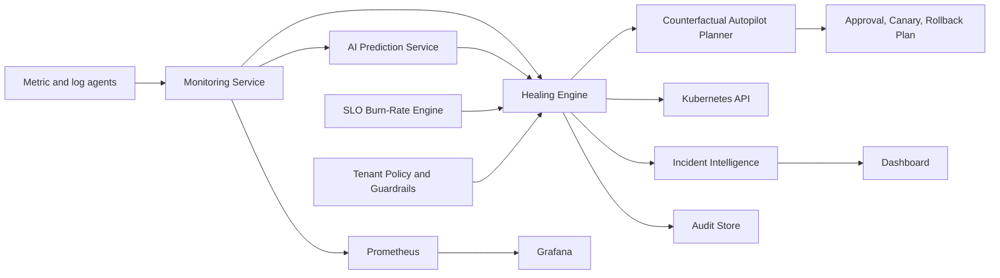
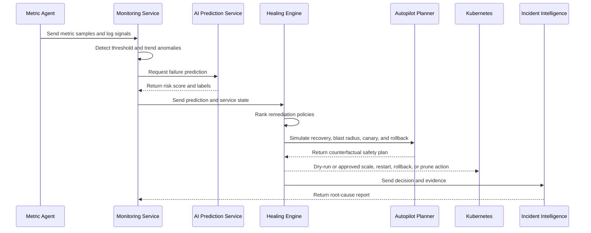

# Architecture

## System View

## Core Loop

## Java Modules

- `platform-core` contains the domain model, anomaly detector, healing policy engine, RL-style policy scorer, and report generator. It has no Spring dependency and can run offline.
- `monitoring-service` exposes metric analysis APIs and produces predictions.
- `healing-engine` exposes remediation decision APIs and updates learned policy scores from outcomes.
- `incident-intelligence-service` converts predictions, logs, and healing decisions into incident reports.
- `governance` controls autonomy modes, tenant action budgets, approval gates, and blast-radius limits.
- `autopilot` generates counterfactual safety plans with recovery probability, residual risk, canary steps, and rollback triggers.
- `slo` turns telemetry windows into burn-rate signals that influence escalation.
- `audit` records system decisions for compliance and interview-grade traceability.

## Important Design Choices

- Dry-run first: remediation commands are generated safely before live execution is enabled.
- Guardrails before execution: every action receives a verdict before it can run.
- Counterfactual before command: remediation is explained with expected recovery, blast radius, rollback triggers, and operator prompts before mutation.
- SLO-first incident response: burn rate determines urgency more reliably than raw CPU alone.
- Domain core first: the main intelligence can be tested without Kubernetes, Docker, or cloud access.
- Policy ranking is separated from action execution so future Kubernetes integration does not disturb anomaly logic.
- AI service is independent because real ML dependencies often evolve faster than Java service contracts.
- Kubernetes RBAC is scoped to deployment and pod operations inside the `aegiscloud` namespace.

## Production Extensions

- Kafka topics:
  - `metrics.ingested`
  - `anomaly.detected`
  - `healing.decisioned`
  - `autopilot.plan.generated`
  - `healing.executed`
  - `incident.reported`
- PostgreSQL tables:
  - `tenants`
  - `services`
  - `metric_samples`
  - `incidents`
  - `healing_actions`
  - `policy_outcomes`
  - `audit_events`
- OpenTelemetry traces should connect metric ingestion, prediction, healing, and report generation.
